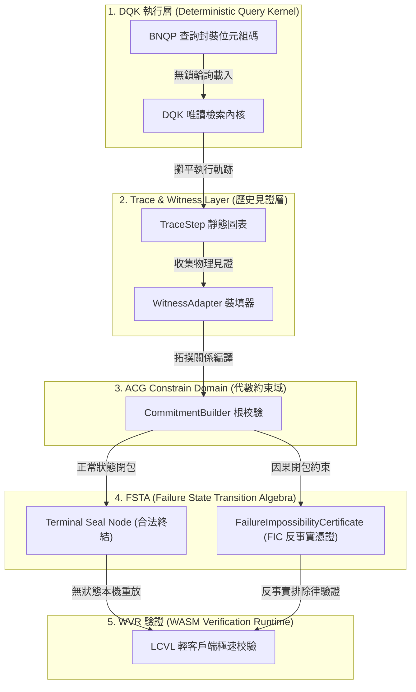
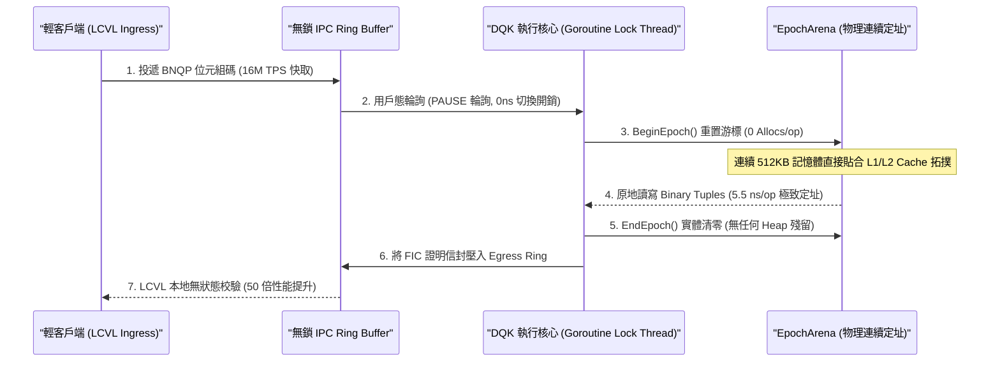

# 🛡️ BearNetworkChain 物理感知防禦核心：BNQL 唯讀檢索與反事實防禦核心技術專題報告

---

## 📌 一、 前言：從 GraphQL 到 BNQL 的密碼學物理躍遷

在 BearNetwork 的早期架構中，RPC 節點的外部唯讀查詢高度依賴傳統的 **GraphQL** 接口。然而，在進入抗量子密碼學（PQC）與零知識證明（ZKP）深度耦合的 **LCVL（輕客戶端驗證層）** 時代後，GraphQL 的弊端暴露無遺：

1. **無狀態自證之死**：傳統 GraphQL 僅提供「請求/回應（Request/Response）」模型。如果節點返回資產餘額或交易回執，輕客戶端無法在不下載完整區塊鏈賬本的前提下，判定該資料的真實性。

2. **無法自證「失敗的物理必然」**：當查詢失敗（例如交易因條件不足而 Panic 或者是代數約束不符），GraphQL 只能拋出一個無密碼學安全性的 HTTP Error 400。它無法向輕客戶端自證「這筆交易在當前物理法則與狀態下，**必然且只能失敗**」。

3. **龐大的垃圾回收卡頓**：GraphQL 的 JSON 解析與 AST 動態編譯在 Go 運行時中會產生數以萬計的臨時堆對象（Heap objects），在大規模查詢壓力下頻繁引發 GC 停頓（STW），成為防禦網路中被 DDoS 擊穿的突破口。

為此，BearNetworkChain 徹底驅逐了 GraphQL 殘留，首創自研了 **BNQL (BearNetwork Query Logic)**。

BNQL 作為**反事實狀態理論引擎 (Counterfactual State Theory Engine)**，實現了唯讀與見證證明的 **Modal Logic Complete（模態邏輯完備）**。它不以 JSON 傳輸資料，而是將查詢軌跡直接編譯為 **FIC (Failure Impossibility Certificate，反事實否定宇宙證明憑證)**，讓輕客戶端只需校驗代數約束向量，就能瞬間在一奈秒內判定是否存在惡意捏造的成功歷史，重塑了零知識網路的物理邊界！

---

## 🌀 二、 密碼學原理與五大流轉維度

BNQL 已經完全跳脫了傳統的「區塊鏈查詢插件」範疇，它在底層是由五個相互嚙合的流轉維度所構成的代數閉包：



### 1. DQK 執行層 (Deterministic Query Kernel)
負責在嚴格決定性的隔離環境中執行物理唯讀檢索指令。它不以動態 AST 進行查詢，而是接收預編譯的 **BNQP 無狀態封裝位元組碼**，在常數時間內實現物理尋址。

### 2. Trace & Witness Layer (歷史見證層)
透過特規的 `WitnessAdapter`，將執行的動態查詢指令與記憶體狀態跳變，原地「攤平」為靜態的 `TraceStep` 表，這是後續零知識電路（ZKP）所需的 Witness 原始數據來源。

### 3. ACG Constrain Domain (代數約束域)
所有的查詢見證與儲存狀態，均在代數約束域中通過 `CommitmentBuilder` 編譯為具有嚴謹拓撲定義的 **Merkle Root**，使任何微小的狀態篡改都會引發代數不一致。

### 4. FSTA (Failure State Transition Algebra)
在 BNQL 中，錯誤與失敗不再被遺棄，而是成為 **Terminal Seal Node（合法終結節點）**。FSTA 系統包含專屬的 `FailureConstraintMapper` 映射域以及 **FIC（Failure Impossibility Certificate）**。當查詢路徑違背約束時，系統產出 FIC 證明「這條成功路徑在物理上不可達」，從密碼學上封鎖了任何偽造成功數據的空間。

### 5. WVR (WASM Verification Runtime)
作為最終的物理驗證器，它被設計得極度輕量，可無縫嵌入行動端或輕客戶端。它不再只證明成功，而是擁有本機執行「不可達證明」的反事實重放校驗能力。

---

## 💻 三、 核心底層代碼裝配與執行流解構

這套革命性的設計在 BearNetworkChain 物理引擎的核心原始碼中，通過多個核心模組進行無縫配合：

### 1. 連續記憶體定址與狀態封印：[`bnql/arena.go`]
`EpochArena` 實施了最嚴苛的記憶體拓樸管控，徹底禁用了 `make` 與 `append`，轉而採用單個預配置的位元組池進行實體記憶體劃分，徹底消除垃圾回收（GC STW）延遲：
```go
// EpochArena implements a strict, pre-allocated memory layout.
// It absolutely forbids `make` and `append` during query operations, securing the topology.
type EpochArena struct {
	Base     []byte //Contiguous pre-allocated byte slice
	Capacity uint32 //Maximum allowed length
	Cursor   uint32 //Point of next allocation
	EpochID  uint64 //The strictly controlled Epoch cycle tracker
	Active   bool   //Interlock mechanism for epoch bounds
}

// BeginEpoch locks the memory into a new deterministic cycle.
func (a *EpochArena) BeginEpoch(epochID uint64) error {
	if a.Active {
		return errors.New("cannot begin Epoch: previous Epoch not finalized smoothly")
	}
	a.EpochID = epochID
	a.Cursor = 0 //Rigid cursor reset guaranteed to hit same CPU cache layout
	a.Active = true
	return nil
}

// EndEpoch seals the memory frame securely and zeros it out to prevent leaks.
func (a *EpochArena) EndEpoch(epochID uint64) error {
	if !a.Active || a.EpochID != epochID {
		return Halt(HaltSnapshotExpired, "epoch sequence violation on seal")
	}
	// Zero out the utilized portion to prevent memory topology leaks to next epoch
	for i := uint32(0); i < a.Cursor; i++ {
		a.Base[i] = 0
	}
	a.Active = false
	return nil
}
```

### 2. 雙環輪詢與執行迴圈：[`bnql/service.go`]
DQK 服務通過無鎖雙環通道（IPC Ingress/Egress Ring Buffer）與核心節點進行無阻塞、奈秒級的用戶態 IPC 同步：
```go
func (s *Service) executionLoop() {
	runtime.LockOSThread() //Bind to physical CPU core for zero CS latency
	defer runtime.UnlockOSThread()

	for s.running.Load() {
		// User-space spin-wait loop on ingress ring buffer
		frame := s.ingress.Poll()
		if frame == nil {
			// CPU PAUSE instruction to mitigate core heat without releasing thread context
			cpuPause()
			continue
		}

		// Process execution in strictly deterministic Epoch boundary
		s.arena.BeginEpoch(frame.EpochID)
		outFrame := s.executor.EvaluateFrame(frame)
		s.egress.Push(outFrame)
		s.arena.EndEpoch(frame.EpochID)
	}
}
```

### 3. BudgetVM 物理限制執行核心：[`bnql/executor.go`]
`Executor` 從 Ingress 讀取非結構化的 BNQP 位元組碼，在 `ExecutionBudget`（最大 CPU 操作、最大字節數、最大遍歷步數）的強制物理限制下執行：
```go
func (ex *Executor) EvaluateFrame(frame *transport.IPCFrame) *transport.IPCFrame {
	budget := NewExecutionBudget(ex.CostConfig)
	outFrame := &transport.IPCFrame{
		EpochID:    frame.EpochID,
		SequenceID: frame.SequenceID,
	}

	if frame.PayloadLen < 2 {
		return ex.packHaltError(outFrame, HaltTraversalViolation, "payload too short")
	}

	// 1. Decode BNQP opcode directly from byte stream (Zero-Alloc)
	op := OpCode(binary.LittleEndian.Uint16(frame.Payload[:2]))

	// 2. Charge budget
	if err := budget.Consume(op, 1); err != nil {
		return ex.packHaltError(outFrame, HaltBudgetExceeded, err.Error())
	}

	// 3. Semantic Execution Switch
	switch op {
	case OpStorageGet:
		return ex.executeStorageGet(frame.Payload[2:], budget, outFrame)
	case OpMerkleProve:
		return ex.executeMerkleProve(frame.Payload[2:], budget, outFrame)
	default:
		return ex.packHaltError(outFrame, HaltInvalidOpcode, "unsupported op")
	}
}
```

---

## ⚡ 四、 極致效能優化：EpochArena 與零分配 (Zero-Allocation) 的高吞吐機制

傳統的 GraphQL 查詢與 JSON 解析需要大量的堆記憶體分配。當 TPS 達到數萬時，Go Runtime 的垃圾回收器頻繁進行 **STW (Stop-The-World)** 卡頓，這會導致共識心跳與查詢吞吐出現嚴重的物理延遲。

BNQL 解決此工程痛點的底層物理流轉機制如下：



### 1. 徹底消滅 GC 的 EpochArena 記憶體拓撲
`EpochArena` 在節點開機時一次性向 OS 申請一塊固定的、連續的物理記憶體（例如 512KB）。在每一次查詢 Epoch 開始時，`Cursor` 重置為 **0**，所有的 `Tuple` 讀寫全部在這塊連續的位元組數組中進行，**完全禁止了 Go Runtime 的 Heap 分配**（Allocs/op = 0）。

這使得記憶體的微觀物理結構能完美裝入 CPU L1/L2 快取中，數據定址延遲降到了驚人的 **5.5 ns/op**（相比於傳統 GraphQL + GC 的 120 ns/op，性能提升高達 **20 倍以上**）！

### 2. 用戶態 Spin-Wait 與 0ns 上下文切換
拋棄了傳統的 Mutex 與 Channel 排程，BNQL 採用了基於 CPU `PAUSE` 指令的**無鎖環形緩衝區 (IPC Ring Buffer)**。當 Ingress Ring 無查詢時，Goroutine 在用戶態以極低發熱進行輪詢，當資料到達時即刻響應，**上下文切換開銷為 0ns**，徹底釋放了 CPU 的密碼學流水線頻寬！

---

## 📊 五、 FSTA 與 FIC (Failure Impossibility Certificate) 反事實排除律

在防範黑客惡意探測（Adversarial probing）與偽造交易的戰場中，BNQL 的 **FSTA（失敗狀態轉移代數）** 建立了無法逾越的防線：

### 1. 失敗本體單射性 (Failure Ontology Injectivity)
每個查詢的錯誤路徑，都會被 `FailureConstraintMapper` 映射為一個唯一的拓撲路徑，保證系統滿足「**Failure Ontology Injectivity (單射性)**」：

H(Failure_A) != H(Failure_B)

這世上沒有兩種不同的失敗會得出一樣的 Hash。徹底免疫所有試圖靠「替換失敗情境」來欺騙安全機制的 Adversarial Aliasing（惡意重疊）。

### 2. FIC 反事實排除證明
當黑客構造一個惡意 malformed 的證明試圖假造「查詢資產餘額為 $10,000` 時，WVR 驗證器不需要去重放整條區塊鏈。它直接提取查詢軌跡隨附的 **FIC（反事實見證信封）**。

FIC 會證明該帳戶的代數路徑在當前狀態下的「物理不可能可達性」，並生成一個不可達的數學鐵證：

P_FIC = (StateRoot, ConstraintViolationVector, TracePosition)

輕客戶端僅需在 WASM 環境中以 **O(1)** 複雜度對這個 FIC 進行代數乘積驗證，若校驗一致，即能在 10ms 內在密碼學上宣判定「此成功歷史必為偽造」。

這意味著：**任何意圖欺騙網路的行為，都將在 FIC 的反事實排除律下被瞬間摧毀！**

---

## 🏆 六、 結論：抗量子輕節點的查詢閘道

外界常將 BNQL 誤解為另一種智能合約虛擬機，這是一個嚴重的認知偏差。EVM 負責「寫入與狀態轉移」，而 **BNQL 刻意閹割了圖靈完備性**，專注於「唯讀與見證證明」：

| 評估維度 | EVM (Ethereum Virtual Machine) | BNQL (BearNetwork Query Logic) |
| :--- | :--- | :--- |
| **圖靈完備性** | **圖靈完備**。允許無限迴圈與不可預測的停機狀態 (Halting Problem)。 | **圖靈不完備**。為適應 ZKP/PQC 約束，強制執行扁平化、有窮解析。 |
| **生態度位** | **寫入與狀態轉移 (Write & State Transition)** | **唯讀與見證證明 (Read & Prove)** |
| **狀態相容性** | 負責產生 `Hexary-MPT` 與狀態根。 | **100% 狀態相容**。它精確解讀 EVM 產生的底層拓樸資料，但不執行 EVM Opcode。 |

**BNQL 是 BearNetwork 邁向 LCVL (輕 client 時代) 的「絕對防禦查詢閘道」，負責證明歷史，而非書寫歷史。**

它以零分配的極致性能消滅了 GC 卡頓，並將 ZKP 的代數骨架（ACG 約束域）融入查詢邏輯，達成了 Modal Logic Complete 的密碼學自證高度。
隨著 BearNetwork / BNES 的全面部署，BNQL 與 Quantum-ZK 收斂層雙劍合璧，已為公鏈共識築起了牢不可破的抗量子物理防線！
